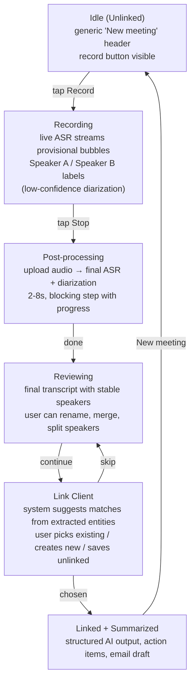
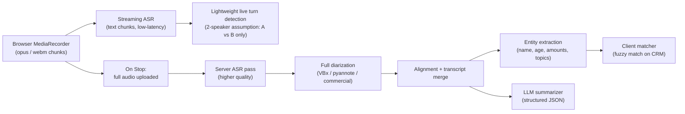

# Counsellor Meeting Assistant — v2 Workflow Spec

> Status: **proposal, not yet implemented**.
> Source decisions: 2026-04-27 product discussion.

## 1. What changed from v1

The v1 demo answered "what does this product look like?".
v2 answers "how does it actually fit into a real counsellor's day?".

Three decisions drive v2:

| # | Decision | Rationale |
|---|---|---|
| D1 | Diarization runs in **two phases** — provisional during live, final after Stop. | Real-time speaker separation is unreliable; full-pass diarization on the recorded audio is much more accurate. |
| D2 | Record control is **inside** the transcript card. | One workspace, one focal point. Removes the "two cards" feel of v1. |
| D3 | The meeting **starts unlinked** — client is linked only after Stop. | Counsellors don't always know who they're meeting before the conversation begins; forcing client selection upfront adds friction and creates dirty data. |

Everything else from v1 (locale, save, AI summarize, action items, follow-up email) stays.

## 2. New end-to-end flow



Key new states: **processing**, **reviewing**, **linking**.

## 3. State machine

v1: `idle → recording → stopped → summarizing → summarized`

v2: `idle → recording → processing → reviewing → (linking) → summarized`

State details:

- **idle** — no client, no transcript. Header reads "未关联会谈 / Unlinked meeting". Only Record is actionable.
- **recording** — live ASR fills bubbles with **provisional** speaker labels (Speaker A / Speaker B). Bubble has a low-confidence visual hint (subtle dashed border).
- **processing** — Stop pressed. UI shows a clear "正在终稿处理 / Finalizing transcript" step. Recording is locked, bubbles fade to grey while final results are awaited.
- **reviewing** — final diarization replaces provisional bubbles. Speaker labels become stable. User can:
  - rename a speaker (propagates),
  - merge two speakers (if model split incorrectly),
  - split a bubble (if model joined incorrectly).
- **linking** — **required step**, not skippable. Entity extraction proposes client candidates. User must pick one of:
  - existing client (top match), or
  - create new client (extracted name pre-filled).
  No "save unlinked" escape hatch — every meeting must be anchored to a client before it can be summarized. This keeps CRM clean and matches how real counsellor records are filed.
- **summarized** — AI summary, action items, email draft, all anchored to the linked client.

## 4. UI changes (concrete)

### 4.1 Unified transcript + record card (D2)

Single card. Top: header. Middle: scrollable bubbles. Bottom: an inline footer dock containing:

```
[ waveform ]   [ 00:14 REC ]   [ ⏺ record/stop ]
```

- During idle, the dock collapses the waveform and shows a hint: "点击开始录音".
- During recording, waveform animates, timer counts up, button is the stop variant.
- During processing, the dock shows a slim progress bar and "正在终稿处理…".

Removes the separate `RecordButton.vue` standalone card. The component itself can be reused but lives **inside** `transcript-section`.

### 4.2 Title behavior (D3)

- **Idle**: header shows a neutral state — no client name, no industry, just `新会谈 / New meeting · {date}`.
- **Recording**: header adds a live indicator (`录音中 · 00:14`).
- **Reviewing**: header still neutral, plus a banner row: "我们识别到可能的客户：王女士 · 选择关联".
- **Linking**: a sheet/modal appears (modal, not dismissible by tapping outside — linking is required) with:
  - top match (if confidence ≥ threshold),
  - search field for existing clients,
  - "创建新客户 / Create new client" prefilled with extracted name.
  The only exits are "link existing" or "create new". The Stop button has effectively committed the user to a real meeting record.
- **Summarized**: header swaps to the linked client info, same look as v1.

### 4.3 Live diarization label (D1)

During recording, do **not** display the final names. Show neutral pills:

- `发言人 A` / `Speaker A` (color violet)
- `发言人 B` / `Speaker B` (color emerald)

**Assume exactly 2 speakers in the live phase** — the live model only does turn detection between A and B. If the final pass discovers a third speaker, that's reconciled in the reviewing transition (see §6).

Provisional bubbles render with a **low-confidence visual hint**:

- 1px dashed border on the bubble (instead of solid),
- speaker pill rendered with reduced opacity (~70%),
- a small `· 实时 / live` tag next to the speaker label.

This makes it visually obvious that "this is a guess, will be corrected after Stop" — without being alarming.

After Stop → processing → reviewing, all three hints disappear together (border, opacity, tag) and labels become editable and resolve to real names.

## 5. Backend pipeline (proposed)



Why two passes:

- **Live pass** is for UX feel only. We accept that speaker labels may be wrong; we just need text streaming in. To keep latency and cost low, the live pass **assumes exactly 2 speakers** and only does turn detection between them.
- **Final pass** owns correctness. Diarization runs against the full audio; speaker count is determined holistically (a 3rd speaker can appear here even though live capped at 2); entities and summary downstream are derived from the *final* transcript, not the live one.

This is the same pattern Otter, Fireflies, etc. use; it's industry-standard and matches what you saw in other apps.

## 6. Edge cases & fallbacks

| Case | Behavior |
|---|---|
| Final diarization agrees with live (still 2 speakers, same turns) | Bubbles fade their dashed border + opacity to solid; speaker pills tween-swap from `Speaker A/B` to final names. ~400ms staggered animation across visible bubbles. |
| Final diarization keeps 2 speakers but reassigns some turns | Reassigned bubbles animate a color cross-fade (e.g. violet → emerald) in addition to the de-provisional fade. One-time toast: "已重新识别说话人". |
| Final diarization discovers a 3rd speaker | Spawn a new color-coded speaker (amber) for affected bubbles with the same fade-in animation. Toast: "识别到第 3 位发言人". |
| Final diarization fails completely | Keep all bubbles assigned to a single speaker, drop the dashed/low-conf styling, surface a "手动分段 / Manually split speakers" affordance in reviewing. |
| Live ASR drops mid-recording (network) | Keep capturing audio locally; show a banner "实时转写已断开，将在结束后完整识别". On Stop, full transcript is rebuilt server-side anyway. |
| Audio upload fails after Stop | Retry x3 with backoff; if still fails, keep raw audio in IndexedDB and show "草稿已保存，下次联网自动同步". |
| No matching client found | Linker opens directly on "create new" tab with extracted name + meeting date prefilled. |
| Multiple plausible clients (≥2 above threshold) | Show top 3 matches with confidence; user must pick (linking is required, see §3). |
| Sensitive content (e.g. ID numbers) detected | Mask in transcript display by default; user can reveal. (Compliance flag, not blocking for v2.) |

## 7. Compliance & consent (must address before real audio)

Adding here because once we move from mock to real microphone, this stops being optional:

- **Pre-record consent screen** — counsellor must confirm client has been informed.
- **Locale-aware consent text** — different jurisdictions have different requirements.
- **Audit log** — store who recorded, when, and whether consent was checked.
- **Data residency** — recordings are PII; backend storage region matters for some clients.
- **Retention** — define how long audio is kept vs how long transcript is kept (often different).

This is a separate compliance work-stream, but v2 should at minimum show the consent screen even if it's a checkbox modal.

## 8. Mapping to current code

If approved, expected file changes:

| File | Change |
|---|---|
| `src/views/CounsellorMeeting.vue` | Add `processing`, `reviewing`, `linking` states; remove eager script-bound title; embed record dock inside transcript card. |
| `src/components/RecordButton.vue` | Convert from card to inline dock variant; same animation primitives. |
| `src/components/SpeakerBubble.vue` | Add `provisional` styling (low-confidence hint); add merge/split affordances. |
| `src/components/SummaryPanel.vue` | Unchanged shape; just gated by `summarized` state. |
| **New** `src/components/ClientLinker.vue` | Sheet for picking existing client / creating new / skipping. |
| **New** `src/components/SpeakerEditor.vue` | Inline merge/split UI in reviewing state. |
| `src/data/mockDialog.js` | Add provisional vs final transcript variants per script (so demo can show the "labels stabilize after Stop" effect). Add a fake CRM client list for the linker. |
| `README.md` | Update flow description; move "consent UI" from "next iteration" into "v2". |

Estimated scope: similar in size to v1 (which was ~1 day's work).

## 9. What's still NOT in v2 (intentional)

- Real microphone capture and real ASR/diarization — v2 stays mocked, but the **state machine matches the real architecture** so swapping in real backends later is a config change, not a rewrite.
- Multi-meeting history view.
- CRM write-back / real email send.
- Counsellor team / admin views.

## 10. Verification when v2 is built

1. Idle screen shows neutral header (no client name, no industry tag).
2. Press Record → bubbles stream with **only `Speaker A` and `Speaker B`** labels — never a third speaker live.
3. Provisional bubbles render with dashed border + 70% pill opacity + `· 实时` tag. Confirm visually.
4. Press Stop → "Finalizing transcript" step is visible.
5. Bubbles transition to final state with **animation** (border solid, opacity restores, pills tween to real names). The animation is staggered, not a hard swap.
6. Run a script where the final pass introduces a 3rd speaker — confirm new amber bubbles fade in with toast "识别到第 3 位发言人".
7. Run a script where the final pass keeps 2 speakers but reassigns a turn — confirm color cross-fade on the reassigned bubble.
8. In reviewing, rename / merge / split a speaker.
9. Continue → ClientLinker opens as a **non-dismissible** modal. Confirm tapping outside / pressing Escape does not close it.
10. Confirm the linker offers exactly two paths (link existing / create new) — no "save unlinked" option anywhere.
11. Summary panel renders only after a client is linked, and is anchored to that client.
12. Repeat in zh and en.
13. Repeat with both 2-speaker and 3-speaker scripts to exercise the §6 reconciliation cases.
